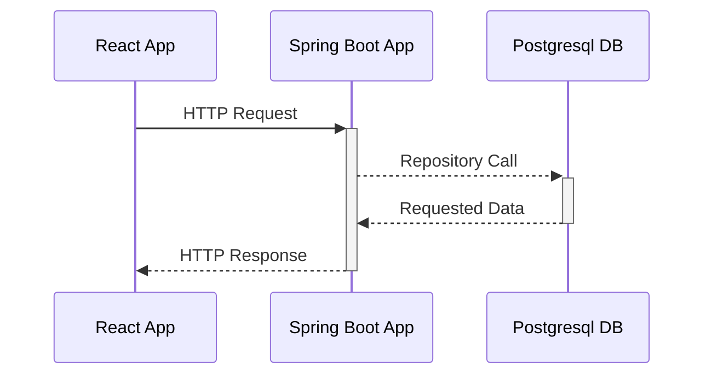

# Callum Armstrong
cwfa20@gmail.com **|** [LinkedIn](https://www.linkedin.com/in/callum-armstrong-168354195/)
## Profile
I'm a Backend Developer specialising in Java. I have knowledge in the following areas:
| Dev  | DevOps |
| ------------- | ------------- |
| Java | Jenkins (Team Admin, Jenkins Node Config) |
| Spring Boot & REST APIs  | Agile Methodology |
| Microservices | Linux Servers |
| Swagger & Postman | Confluence & JIRA |
| HTML, CSS, JS & React | GitLab & Bitbucket |
| Unix | SonarQube |
| Python | JFrog Artifactory |

## What I'm working on
User Management System comprised of a Java Spring Boot backend and React JS frontend
> Aim - to connect the backend, frontend & DB as a proof of concept in my first side project. I will progressively add more technologies e.g. message queue (Kafka/IBM MQ) in order to understand more about the technology and the configuration required.

